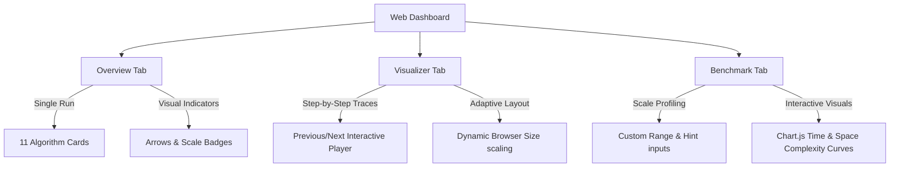

# Vedic Maths vs Modern Maths: Multiplication Benchmarker & Visualizer

An advanced visual and computational benchmarking suite comparing **11 multiplication algorithms** across ancient Indian (Vedic) Mathematics and modern computer science. This project bridges 1,500+ years of mathematical history, pitting the intuitive, mental-arithmetic systems of Indian scholars against the divide-and-conquer, frequency-domain, and dynamic programming algorithms of modern computing.

**Live Demo**: *(Add your Vercel URL here after deploying)*

   

---

## 📖 Table of Contents
1. [Interactive Dashboard Walkthrough](#-interactive-dashboard-walkthrough)
2. [Performance Indicators & Scalability Badges](#-performance-indicators--scalability-badges)
3. [Deep-Dive Algorithm Profiles (11 Total)](#-deep-dive-algorithm-profiles-11-total)
    - [Swami Bharati's Urdhva Tiryakbhyam](#1-urdhva-tiryakbhyam-general)
    - [Swami Bharati's Nikhilam Navatashcaramam](#2-nikhilam-navatashcaramam-specialized)
    - [Swami Bharati's Ekadhikena Purvena](#3-ekadhikena-purvena-specialized)
    - [Swami Bharati's Ekanyunena Purvena](#4-ekanyunena-purvena-specialized)
    - [Aryabhata/Sridharacharya's Kapatasandhi (Lattice)](#5-kapatasandhi-lattice-general)
    - [Bhaskara II's Khanda Ganita (Distributive)](#6-khanda-ganita-distributive-general)
    - [Schoolbook Long Multiplication](#7-schoolbook-long-multiplication-general)
    - [Karatsuba Algorithm](#8-karatsuba-algorithm-general)
    - [Dynamic Programming (DP) Multiplication](#9-dynamic-programming-dp-multiplication-general)
    - [FFT Multiplication (Schönhage-Strassen Baseline)](#10-fft-multiplication-sch%C3%B6nhage-strassen-general)
    - [Python Built-In (Baseline)](#11-python-built-in-baseline-general)
4. [💻 Local Development & CLI Modes](#-local-development--cli-modes)
5. [🚀 Vercel Cloud Deployment](#-vercel-cloud-deployment)
6. [💰 Google AdSense Integration](#-google-adsense-integration)
7. [📂 Project Directory Structure](#-project-directory-structure)
8. [⚠️ Cloud Limits & Guardrails](#-cloud-limits--guardrails)

---

## 🎨 Interactive Dashboard Walkthrough

The application features a responsive, glassmorphic web dashboard built using HTML5, Vanilla CSS3, and JavaScript (ES6+). It contains three core tabs:



### 1. Overview Tab
* **Goal**: Provides immediate side-by-side verification and profiling for any single pair of numbers.
* **Operation**:
  1. Input manually or click the **Generate** button to create random, Nikhilam-suitable, Ekadhikena-suitable, or Ekanyunena-suitable digit pairs.
  2. Click **Multiply & Profile** to execute all 11 algorithms in parallel.
  3. The results are laid out in a grid of cards detailing:
     - **Status**: Whether the output matches the correct mathematical product.
     - **Time**: Execution time (in milliseconds `ms` or microseconds `µs`).
     - **Memory**: Peak heap memory allocated during calculation.
     - **Operations**: Fine-grained counts of **Digit Multiplications**, **Digit Additions**, and **Memory Writes**.

### 2. Step-by-Step Visualizer Tab
* **Goal**: Deconstructs and visualizes the math step-by-step to demonstrate *how* the algorithms calculate products.
* **Operation**:
  - Input numbers up to **12 digits** (to maintain readability).
  - Select any of the supported algorithms (Urdhva, Kapatasandhi, Schoolbook, Khanda Ganita, etc.).
  - Use the interactive playback buttons (**Previous**, **Play/Pause**, **Next**, **Reset**) to step through the execution.
  - The UI dynamically highlights which digits are being multiplied, intermediate carries, and cell-by-cell accumulations.
  - **Dynamic Viewport Scaling**: The visualizer is responsive and automatically resizes its layout to fit the browser width dynamically.

### 3. Scalability Benchmark Tab
* **Goal**: Visualizes how time and space complexities scale as the input size grows from small inputs to large-scale digits.
* **Operation**:
  - Enter custom digit sizes (e.g., `10, 50, 100, 500, 1000`). Hint links are provided on the screen instead of pre-populating text fields.
  - Select whether to use standard random numbers or base-aligned Nikhilam-suitable pairs.
  - Run the benchmark to generate two interactive **Chart.js** line graphs:
    1. **Time Complexity Profile**: Shows execution time (ms) relative to digit size.
    2. **Space Complexity Profile**: Shows peak memory (bytes) relative to digit size.

---

## 🟢🔴 Performance Indicators & Scalability Badges

To make performance differences visually intuitive, the dashboard includes dynamic visual cues on every card:

### 1. Performance Arrows (▲ / ▼)
Every algorithm's execution metrics are compared directly against the standard **Modern Schoolbook Long Multiplication** as a baseline:
* **Green Up Arrow (▲)**: Indicates higher efficiency. The algorithm took less time or used less memory than the Schoolbook baseline.
* **Red Down Arrow (▼)**: Indicates lower efficiency. The algorithm took more time or used more memory than the Schoolbook baseline (common for recursion/complex setup overhead on small numbers).

### 2. Scalability Badges
Algorithms are classified to guide users on their ideal operating ranges:
* <span style="color:#10b981; font-weight:bold;">Best for Large Scale</span>: Displayed on scalable algorithms that excel as digit sizes grow into hundreds or thousands of digits. This includes general algorithms with optimized complexity profiles: **Urdhva Tiryakbhyam**, **Kapatasandhi (Lattice)**, **Khanda Ganita (Distributive)**, **Karatsuba**, **FFT**, and the **Python Built-in** baseline.
* <span style="color:#3b82f6; font-weight:bold;">Best for Small Scale</span>: Displayed on specialized algorithms that are lightning-fast for small numbers but have mathematical constraints or growth patterns that make them less suitable for massive generic digit sizes. This includes **Nikhilam**, **Ekadhikena**, and **Ekanyunena**.

---

## 📊 Deep-Dive Algorithm Profiles (11 Total)

Here is the exhaustive mathematical and historical profile of all 11 algorithms implemented in the engine.

---

### 1. Urdhva Tiryakbhyam (General)
* **Origin**: Re-discovered from the Atharvaveda and compiled by **Swami Bharati Krishna Tirtha Ji** in his book *Vedic Mathematics* (1965).
* **Mathematical Formula**:
  For two numbers A = sum(a_i × 10^i) and B = sum(b_j × 10^j), the coefficient at position k is:
  ```
  P_k = sum of (a_i × b_j) for all pairs where i + j = k
  ```
* **How It Works**:
  Known as the "Vertically and Crosswise" formula. 
  1. Align both numbers. 
  2. For each step k (from right to left), find all pairs of digits (a_i, b_j) whose indices sum to k.
  3. Multiply these digit pairs and sum them together.
  4. Write down the units digit of the sum at position k, and pass the remaining quotient forward as a carry to step k+1.
* **Complexity**: Time: O(N²) | Space: O(N)
* **Scalability**: <span style="color:#10b981; font-weight:bold;">Best for Large Scale</span> (highly parallelizable, low arithmetic overhead).

---

### 2. Nikhilam Navatashcaramam (Specialized)
* **Origin**: Compilations by **Swami Bharati Krishna Tirtha Ji** in *Vedic Mathematics* (1965).
* **Mathematical Formula**:
  For base B = 10^d, deviations D1 = A − B and D2 = C − B:
  ```
  A × C = (A + D2) × B + (D1 × D2)
  ```
* **How It Works**:
  Translated as "All from 9 and the last from 10." Ideal for numbers close to a base (power of 10, e.g., 98 × 97 close to 100):
  1. Determine the closest power of 10 (base B).
  2. Subtract the base from each number to find deviations D1 and D2. (Using the "All from 9 and last from 10" shortcut to subtract quickly).
  3. Split the result: the left side is A + D2 (or C + D1), and the right side is the deviation product D1 × D2.
  4. Combine the sides, carrying excess digits if the deviation product exceeds the base's digit width.
* **Complexity**: Time: O(N) specialized | Space: O(N)
* **Scalability**: <span style="color:#3b82f6; font-weight:bold;">Best for Small Scale</span> (extremely fast when close to bases, but specialized).

---

### 3. Ekadhikena Purvena (Specialized)
* **Origin**: **Swami Bharati Krishna Tirtha Ji**, *Vedic Mathematics* (1965).
* **Mathematical Formula**:
  For numbers with identical prefix P and unit digits u1, u2 such that u1 + u2 = 10:
  ```
  A × C = [P × (P + 1)] × 10² + (u1 × u2)
  ```
* **How It Works**:
  Translated as "By one more than the previous."
  1. Verify the numbers share a prefix and their last digits add up to 10 (e.g., 74 × 76, prefix 7, units 4 and 6).
  2. Multiply the prefix by "itself plus one" (7 × 8 = 56). This forms the left part of the product.
  3. Multiply the unit digits (4 × 6 = 24). This forms the right part.
  4. Concatenate the two parts (5624).
* **Complexity**: Time: O(N) specialized | Space: O(N)
* **Scalability**: <span style="color:#3b82f6; font-weight:bold;">Best for Small Scale</span> (specialized case).

---

### 4. Ekanyunena Purvena (Specialized)
* **Origin**: **Swami Bharati Krishna Tirtha Ji**, *Vedic Mathematics* (1965).
* **Mathematical Formula**:
  When multiplier is 999... (represented as 10^d − 1):
  ```
  A × (10^d − 1) = (A − 1) × 10^d + [(10^d − 1) − (A − 1)]
  ```
* **How It Works**:
  Translated as "By one less than the previous."
  1. Identify the non-nine multiplicand A and the nine-series multiplier M = 999....
  2. Left part of result is A − 1.
  3. Right part of result is M − (A − 1) (easily calculated by subtracting each digit of the left part from 9).
  4. Concatenate the left and right parts.
* **Complexity**: Time: O(N) specialized | Space: O(N)
* **Scalability**: <span style="color:#3b82f6; font-weight:bold;">Best for Small Scale</span> (specialized case).

---

### 5. Kapatasandhi (Lattice / General)
* **Origin**: Ancient India; documented by **Aryabhata** in the *Aryabhatiya* (499 CE) and **Sridharacharya** in the *Patiganita* (8th-10th century). Later traveled to Europe via Arab scholars as "Lattice/Gelosia" multiplication.
* **Mathematical Diagram**:
  ```
     4       5       (Multiplicand)
   +---+   +---+
   |2 /|   |2 /|  5
   | /0|   | /5|
   +---+   +---+
   |1 /|   |1 /|  3   (Multiplier)
   | /2|   | /5|
   +---+   +---+
  ```
* **How It Works**:
  Known as the "door-joint" method.
  1. Construct a grid of size M × N. Draw a diagonal line through each cell from top-right to bottom-left.
  2. Write the first number along the top and the second along the right.
  3. Multiply the digit of each row and column, writing the tens digit in the upper-left half-cell and the units digit in the lower-right half-cell.
  4. Sum the numbers along the diagonals starting from the bottom-right.
  5. Carry over any tens digits to the next diagonal sum on the left.
* **Complexity**: Time: O(N²) | Space: O(N²) grid space.
* **Scalability**: <span style="color:#10b981; font-weight:bold;">Best for Large Scale</span> (computationally robust, visualizer scales dynamically).

---

### 6. Khanda Ganita (Distributive / General)
* **Origin**: Developed by the legendary Indian mathematician **Bhaskara II (Bhaskaracharya)** and written in his famous mathematical treatise *Lilavati* (~1150 CE).
* **Mathematical Formula**:
  For multiplier B split into digits b_j with place value Place_j = 10^j:
  ```
  A × B = sum of (A × b_j) × 10^j
  ```
* **How It Works**:
  Translated as "Part Multiplication."
  1. Keep the multiplicand A intact.
  2. Decompose the multiplier B into its positional digits (e.g. 234 → 4 + 30 + 200).
  3. Multiply A by each digit and shift the product by the corresponding place value.
  4. Sum all shifted products to get the final result.
* **Complexity**: Time: O(N²) | Space: O(N)
* **Scalability**: <span style="color:#10b981; font-weight:bold;">Best for Large Scale</span> (the precursor to modern long multiplication).

---

### 7. Schoolbook Long Multiplication (General)
* **Origin**: Traces back to Islamic mathematician **Al-Khwarizmi** (~825 CE), refined during the Italian Renaissance, and adopted globally.
* **Mathematical Formula**:
  ```
  A × B = sum over j=0..M-1 of ( sum over i=0..N-1 of a_i × b_j × 10^(i+j) )
  ```
* **How It Works**:
  1. Multiply the entire multiplicand by the least significant digit of the multiplier, handling carries.
  2. Write this down as the first partial product.
  3. Repeat for the next digit of the multiplier, adding a zero placeholder to shift left.
  4. Stack all partial products and add them together vertically.
* **Complexity**: Time: O(N²) | Space: O(N²) to store all rows.
* **Scalability**: <span style="color:#10b981; font-weight:bold;">Best for Large Scale</span> (standard general baseline).

---

### 8. Karatsuba Algorithm (General)
* **Origin**: Developed by Russian mathematician **Anatoly Karatsuba** in 1960, published in 1962. It disproved Kolmogorov's conjecture that O(N²) was the lower bound for multiplication.
* **Mathematical Formula**:
  Let x = x1 × 10^m + x0 and y = y1 × 10^m + y0.
  Calculate:
  ```
  z2 = x1 × y1
  z0 = x0 × y0
  z1 = (x1 + x0)(y1 + y0) − z2 − z0
  Result = z2 × 10^(2m) + z1 × 10^m + z0
  ```
* **How It Works**:
  A recursive divide-and-conquer algorithm:
  1. Split inputs into upper and lower halves of length m = N/2.
  2. Compute three smaller multiplications (z2, z0, and the combined z1 helper) recursively.
  3. Compute the middle term using subtraction (z1 = helper − z2 − z0). This trick eliminates one of the four multiplications required by standard distributive expansion.
  4. Combine the terms using bit shifts (multiplication by powers of 10) and additions.
* **Complexity**: Time: O(N^1.585) | Space: O(N) recursion depth.
* **Scalability**: <span style="color:#10b981; font-weight:bold;">Best for Large Scale</span> (outperforms O(N²) algorithms as digit size grows).

---

### 9. Dynamic Programming (DP) Multiplication (General)
* **Origin**: Bottom-up optimization applying **Richard Bellman's Principle of Optimality** (1950s) to digit transition recurrences.
* **Mathematical Formula**:
  Let dp[i] represent the product of A and the suffix B[i:].
  ```
  dp[i] = (A × B[i]) × 10^(M − 1 − i) + dp[i+1],  with dp[M] = 0
  ```
* **How It Works**:
  Prevents redundant digit-level multiplications by using a lookup cache:
  1. Precalculate a 10 × 10 multiplication table containing all possible single-digit products (0 × 0 to 9 × 9).
  2. Process the multiplier bottom-up from the least significant digit (index i = M−1 down to 0).
  3. Calculate A × B[i] by fetching products from the DP cache instead of executing CPU multiplication instructions.
  4. Scale by place value and accumulate into the DP state array.
* **Complexity**: Time: O(N²) lookup transitions | Space: O(N) state storage.
* **Scalability**: <span style="color:#10b981; font-weight:bold;">Best for Large Scale</span> (replaces arithmetic multiplications with constant-time O(1) cache lookups).

---

### 10. FFT Multiplication (General)
* **Origin**: Arnold Schönhage and Volker Strassen in 1971 (Schönhage-Strassen algorithm).
* **Mathematical Formula**:
  ```
  A × B = IFFT( FFT(A) ⊙ FFT(B) )
  ```
  where ⊙ represents pointwise (Hadamard) vector multiplication.
* **How It Works**:
  1. Treat numbers as polynomials: A(x) = sum(a_i × x^i) and B(x) = sum(b_i × x^i) evaluated at x = 10.
  2. Convert digit arrays into the frequency domain using the Fast Fourier Transform (FFT).
  3. Perform pointwise multiplication of the complex numbers in the frequency domain.
  4. Perform the Inverse Fast Fourier Transform (IFFT) to return the coefficients to the time domain.
  5. Round coefficients to the nearest integers, propagate carries, and construct the final digits.
* **Complexity**: Time: O(N log N) | Space: O(N) complex arrays.
* **Scalability**: <span style="color:#10b981; font-weight:bold;">Best for Large Scale</span> (the asymptotic gold standard for extremely large integers).

---

### 11. Python Built-In (Baseline)
* **Origin**: CPython core implementation. Uses GMP (GNU Multiple Precision Arithmetic Library) paradigms and C-level bit-shifting.
* **How It Works**:
  CPython represents arbitrary-precision integers using arrays of digits in base 2^30 (on 64-bit platforms). It executes multiplications directly in compiled C, switching dynamically between:
  - Schoolbook long multiplication (for very small numbers).
  - Karatsuba multiplication (for medium numbers).
  - Highly optimized C loops with hardware-level registers.
* **Complexity**: Asymptotic Time: O(N^1.585) to O(N log N) | Space: O(N)
* **Scalability**: <span style="color:#10b981; font-weight:bold;">Best for Large Scale</span> (highly optimized low-level baseline).

---

## 💻 Local Development & CLI Modes

You can run the engine locally without any external dependencies. All modules are implemented using the Python standard library.

### 1. Launching the Local Web Dashboard
Run the server locally:
```bash
python main.py --web
```
This launches a local HTTP server at `http://127.0.0.1:8000/`. It uses the files located in the `web/` folder, which are optimized for local use and do not contain AdSense slots.

### 2. Running Automated Verification
Run correctness verifications on all 11 algorithms:
```bash
python main.py --verify
```
This generates random test cases of sizes up to 200 digits and compares the output of every algorithm against Python's built-in multiplier. If any algorithm returns an incorrect value, it exits with status code `1`.

### 3. Interactive CLI Mode
If run without arguments, the tool starts an interactive command-line interface:
```bash
python main.py
```
This CLI menu allows you to:
1. Perform single multiplication benchmarking with manual entries or generated test cases.
2. Run scaling benchmarks and print ASCII tables showing time/memory scaling behavior.
3. Launch verification tests.
4. Start the local web server.

### 4. Running a Quick CLI Benchmark
Benchmark a specific pair of numbers from the command line:
```bash
python main.py --benchmark 123456789012345 987654321098765
```

---

## 🚀 Vercel Cloud Deployment

The repository includes configuration to deploy the web application to Vercel as a serverless application.

### Prerequisites
1. Install [Git](https://git-scm.com/) on your local machine.
2. Install the [Vercel CLI](https://vercel.com/cli) (`npm install -g vercel`) or create a free account at [vercel.com](https://vercel.com).

### Step-by-Step Deployment

#### Method A: Direct Vercel Git Integration (Recommended)
1. Initialize git and commit your files:
   ```bash
   git init
   git add .
   git commit -m "Deploy Vedic vs Modern Benchmarker"
   ```
2. Create a new repository on GitHub.
3. Link your local repository to GitHub and push:
   ```bash
   git remote add origin https://github.com/YOUR_USERNAME/YOUR_REPO_NAME.git
   git branch -M main
   git push -u origin main
   ```
4. Go to [vercel.com/new](https://vercel.com/new) and import your repository.
5. Vercel will automatically read the `vercel.json` configuration and deploy your app.

#### Method B: Vercel Command Line
1. Open terminal inside the project directory.
2. Run the `vercel` command:
   ```bash
   vercel
   ```
3. Follow the prompts to link the project to your Vercel account.
4. Deploy to production:
   ```bash
   vercel --prod
   ```

---

## 💰 Google AdSense Integration

The files deployed to Vercel (`public/index.html` and `public/app.js`) are configured with **4 Google AdSense ad slots** to monetize the application.

### Setting Up Your Ads
1. Log into your [Google AdSense Dashboard](https://adsense.google.com).
2. Register your deployed website domain.
3. Retrieve your **Publisher ID** (e.g., `ca-pub-1234567890123456`).
4. Create four different **Display Ad Units** (responsive or fixed sizes matching the layout) and get their **Ad Slot IDs** (10-digit numbers).
5. Open `public/index.html` and replace:
   - All occurrences of `ca-pub-XXXXXXXXXXXXXXXX` with your actual Publisher ID.
   - The corresponding slot placeholders with your Ad Slot IDs:
     - `XXXXXXXXXX` (Header Slot: Recommended 728x90 Leaderboard or responsive)
     - `YYYYYYYYYY` (Mid-Content Slot: Recommended responsive display)
     - `ZZZZZZZZZZ` (Benchmark Sidebar Slot: Recommended 300x250 Square)
     - `WWWWWWWWWW` (Footer Slot: Recommended 728x90 Leaderboard or responsive)
6. Commit the changes and redeploy to Vercel.

---

## 📂 Project Directory Structure

```
├── api/                    # Vercel Serverless Functions (Python 3.12)
│   ├── generate.py         # POST /api/generate (handles number generation)
│   ├── multiply.py         # POST /api/multiply (profiles single multiplications)
│   └── bench.py            # POST /api/bench (profiles scalability benchmark runs)
├── public/                 # Vercel Production Frontend (Google AdSense enabled)
│   ├── index.html          # Web page containing AdSense slots
│   ├── app.js              # Client-side routing to /api/bench and visualizer logic
│   └── style.css           # Styling with ad container rules
├── web/                    # Original Local Development Frontend (No ads)
│   ├── index.html          # Ad-free layout
│   ├── app.js              # Client-side routing to local server /api/benchmark
│   └── style.css           # Styling
├── vedic_maths.py          # Vedic multiplication algorithms
├── modern_maths.py         # Modern multiplication algorithms
├── benchmark.py            # Computational benchmarking engine
├── main.py                 # CLI interface, argument parser, and launcher
├── server.py               # Local Python HTTP server (built-in standard library)
├── vercel.json             # Vercel serverless build and routing configuration
├── requirements.txt        # Python dependency manifest (standard library only)
└── README.md               # This documentation file
```

---

## ⚠️ Cloud Limits & Guardrails

To run efficiently on the **Vercel Free Serverless Tier** without hitting resource exhaustions, several guardrails are built into the cloud API:

1. **Timeout Cap**: Vercel Serverless Functions have a hard **10-second** execution limit on the free tier.
2. **Single Multiplication Limit**: Inputs are capped at **2,000 digits** in cloud mode to prevent serverless function timeouts.
3. **Scaling Benchmark Limit**: The benchmark size is capped at a maximum of **500 digits** and a maximum of **8 data points**.
4. **Local Execution Alternative**: For massive numbers (e.g. 5,000+ digits) and extensive benchmark configurations, run the app locally using `python main.py --web` to leverage your local machine's raw CPU limits without Vercel's cloud timeouts.

---

*Built with ❤️ to honor ancient Indian mathematical heritage and explore modern computational complexity.*
